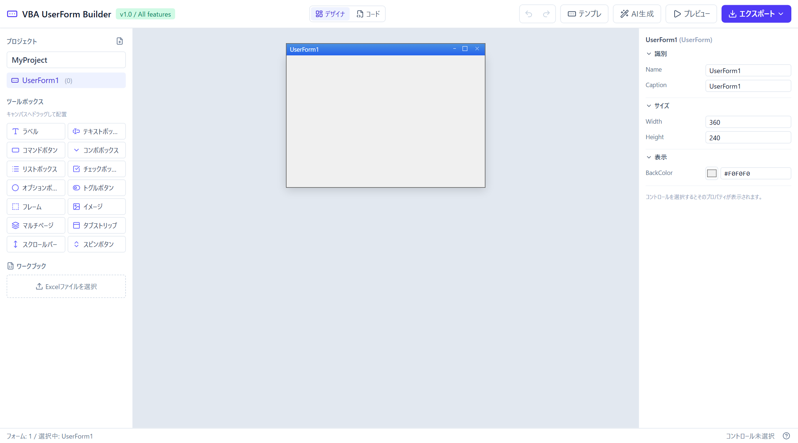
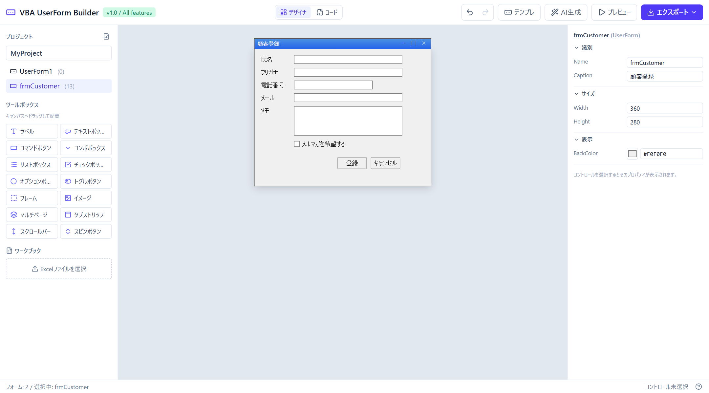
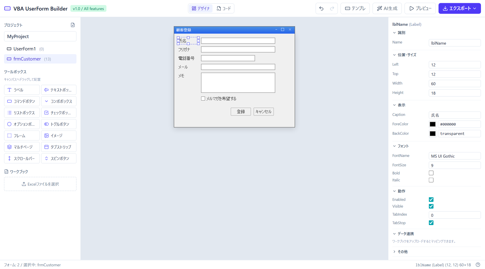
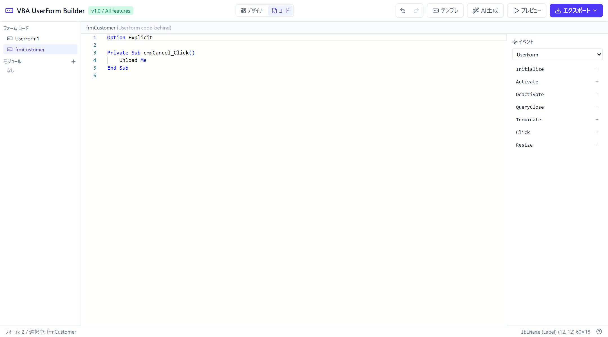
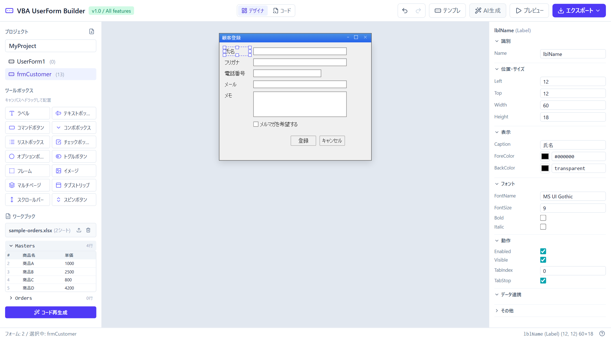
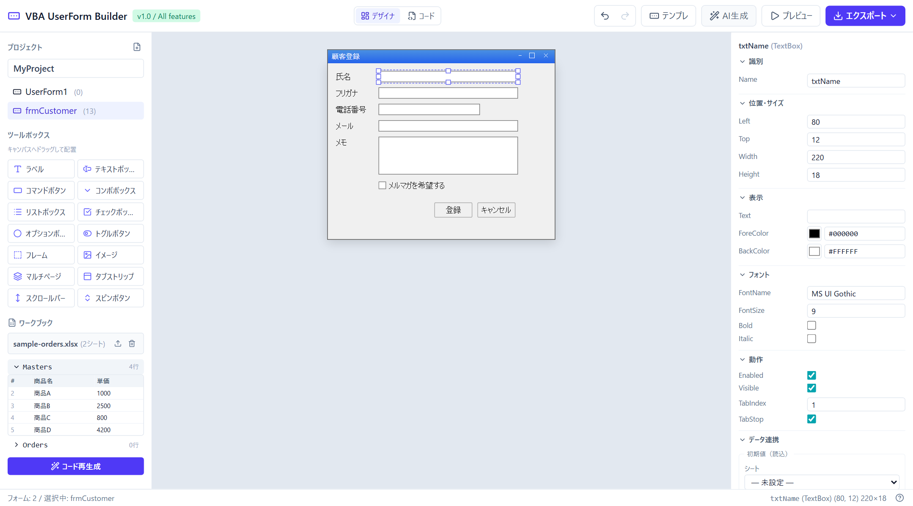
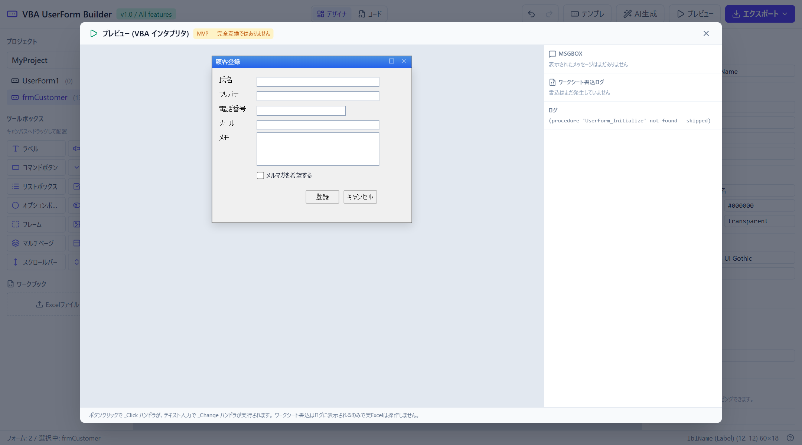
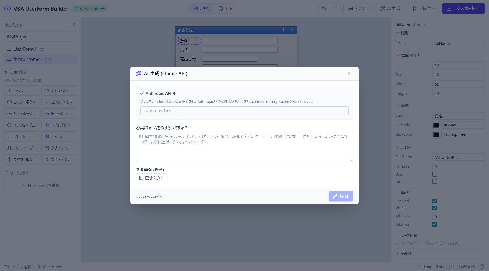
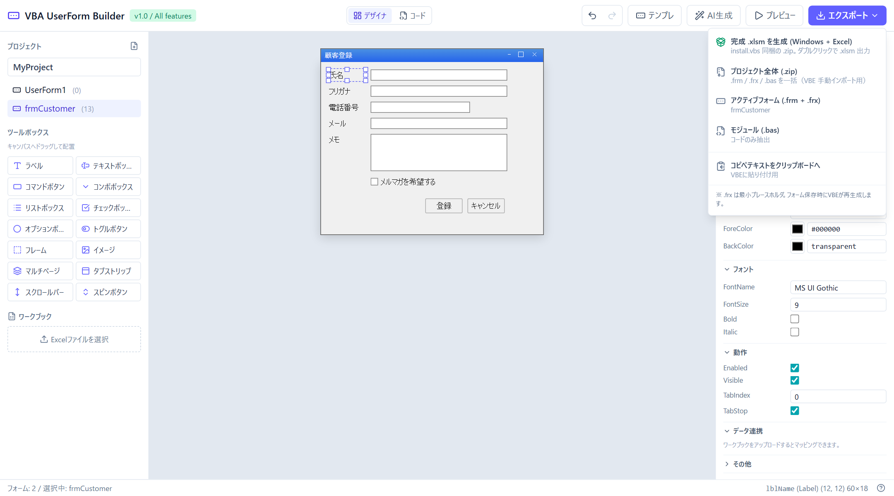
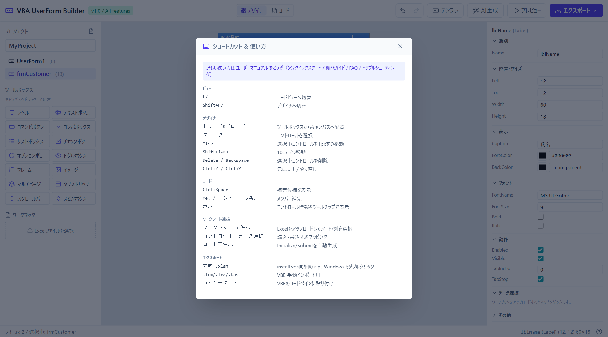

# VBA UserForm Builder ユーザーマニュアル

ブラウザだけで Excel VBA の UserForm を作れるツールです。サーバには一切データを送らず、すべてあなたの PC 内（ブラウザのローカルストレージ）で完結します。

**サイト**: https://kst02w.github.io/vba-userform-builder/

---

## もくじ

1. [これは何ができるツール？](#1-これは何ができるツール)
2. [3分でやってみる（クイックスタート）](#2-3分でやってみるクイックスタート)
3. [画面の見方](#3-画面の見方)
4. [機能ガイド](#4-機能ガイド)
   - [4.1 デザイナでフォームを作る](#41-デザイナでフォームを作る)
   - [4.2 コードを書く](#42-コードを書く)
   - [4.3 Excel と連携する](#43-excel-と連携する)
   - [4.4 プレビューで動かしてみる](#44-プレビューで動かしてみる)
   - [4.5 AI に作ってもらう](#45-ai-に作ってもらう)
   - [4.6 テンプレートから始める](#46-テンプレートから始める)
   - [4.7 エクスポートして Excel に持っていく](#47-エクスポートして-excel-に持っていく)
5. [典型シナリオ：受注入力フォームを作る](#5-典型シナリオ受注入力フォームを作る)
6. [よくある質問（FAQ）](#6-よくある質問faq)
7. [制限事項](#7-制限事項)
8. [ショートカット早見表](#8-ショートカット早見表)
9. [トラブルシューティング](#9-トラブルシューティング)

---

## 1. これは何ができるツール？

普通、Excel VBA で UserForm を作るには Excel を開いて Alt+F11 で VBE を起動して…と手間がかかります。このツールは：

- **ブラウザでドラッグ&ドロップ** でフォームを作れる
- **VBA コードもブラウザで書ける**（補完つき）
- **Excel シートと連携するコードを自動生成**
- **動作確認もブラウザでできる**（インタプリタ内蔵）
- **完成したら .xlsm にしてダウンロード**

ターゲット：

- 「ちょっとした入力フォームを VBA で作りたい」業務改善担当の方
- 「VBA は分かるけど、UserForm のデザイナがいちいち遅くて嫌」な開発者
- 「自然言語から VBA フォームを生成したい」AI を使い倒したい人

---

## 2. 3分でやってみる（クイックスタート）

### 一番ラクな道

1. サイトを開く → https://kst02w.github.io/vba-userform-builder/
2. 画面上部の **「テンプレ」** ボタン → 「**顧客登録フォーム**」を選択
3. フォームがキャンバスに表示される
4. 上部 **「プレビュー」** ボタン → 動作確認できる
5. 上部 **「エクスポート ▾」** → **「完成 .xlsm を生成 (Windows + Excel)」**
6. ダウンロードされた .zip を展開 → `install.vbs` をダブルクリック
7. Excel が起動して、フォーム入りの `.xlsm` ができあがる！

→ Excel で Alt+F11 → 左ペインの `frmCustomer` をダブルクリック → F5 で起動

### 完全に自分で作りたい場合

1. 左の **ツールボックス** からコントロール（ボタン・テキストボックスなど）を **キャンバスにドラッグ**
2. 配置したコントロールをクリック → **右パネルでプロパティを編集**（名前・色・サイズなど）
3. 上部 **「コード」** ボタン → VBA コードを書く（補完が効きます）
4. 上部 **「プレビュー」** で動作確認
5. **「エクスポート」** で .xlsm として保存

---

## 3. 画面の見方



### 上部バー（ヘッダー）
- **デザイナ / コード**: 表示モードを切替（**F7 / Shift+F7**）
- **↶ ↷**: 元に戻す / やり直し（**Ctrl+Z / Ctrl+Y**）
- **テンプレ**: 用意済みのテンプレートから新規フォーム
- **AI生成**: Claude にお願いしてフォームを作ってもらう
- **プレビュー**: 作ったフォームを動かしてみる
- **エクスポート ▾**: .xlsm / .zip / .frm / コピペテキスト

### 左サイドバー（デザイナビュー時）
- **プロジェクト**: フォーム一覧（追加・選択・削除）
- **ツールボックス**: 14種類のコントロール
- **ワークブック**: Excel ファイルをアップロードしてシートを表示

### 右サイドバー
- **プロパティパネル**: 選択中のコントロール（またはフォーム自体）の各種設定
- 「データ連携」セクション: シートのどの列と紐付けるか

### コードビュー時
- 左: フォーム/モジュール一覧
- 中央: Monaco エディタ（VBA 構文ハイライト・補完つき）
- 右: イベントスタブ挿入パネル

---

## 4. 機能ガイド

### 4.1 デザイナでフォームを作る




#### コントロールを配置する
1. 左の **ツールボックス** から配置したいコントロール（例: 「テキストボックス」）をクリックして押し続ける
2. **キャンバスの好きな位置にドラッグ**
3. マウスを離すと配置完了

| ツール名 | VBA名 | 用途 |
|---|---|---|
| ラベル | Label | テキスト表示 |
| テキストボックス | TextBox | 文字入力 |
| コマンドボタン | CommandButton | クリック実行 |
| コンボボックス | ComboBox | 選択（入力可） |
| リストボックス | ListBox | 選択（一覧表示） |
| チェックボックス | CheckBox | ON/OFF |
| オプションボタン | OptionButton | 排他選択 |
| トグルボタン | ToggleButton | 押下状態を保持 |
| フレーム | Frame | グループ化 |
| イメージ | Image | 画像表示 |
| マルチページ | MultiPage | タブ |
| タブストリップ | TabStrip | タブ（ページ無し） |
| スクロールバー | ScrollBar | 値選択 |
| スピンボタン | SpinButton | 数値増減 |

#### コントロールを操作する
- **選択**: クリック
- **移動**: ドラッグ、または矢印キー（**Shift+矢印で10pxずつ**）
- **サイズ変更**: 右下のハンドル（青い点）をドラッグ
- **削除**: 選択して **Delete** または **Backspace**

#### プロパティを変える



右パネルで：
- **Name**: VBA でこのコントロールを参照する名前（例: `txtName`）
- **Caption / Text**: 表示文字
- **位置・サイズ**: Left / Top / Width / Height
- **色**: ForeColor (文字色) / BackColor (背景色)
- **フォント**: FontName / FontSize / Bold / Italic
- **動作**: Enabled / Visible / TabIndex / TabStop

> **コツ**: VBA 命名規則は接頭辞をつけると分かりやすいです  
> `txt` (TextBox), `cmb` (ComboBox), `cmd` (CommandButton), `chk` (CheckBox), `lbl` (Label)

#### フォーム全体のプロパティ
キャンバス内の空白部分をクリックすると、右パネルが「UserForm」のプロパティに変わります：
- **Name**: VBA モジュール名（例: `frmCustomer`）
- **Caption**: タイトルバー表示
- **Width / Height**: フォーム本体のサイズ
- **BackColor**: フォーム背景色

---

### 4.2 コードを書く

上部 **「コード」** ボタン（または **F7**）でコードビューに切替。



#### エディタの使い方
- **Ctrl+Space**: 補完候補表示
- **Me.** と入力 → フォーム自身のプロパティ・コントロール名が候補に
- **TextBox1.** と入力 → そのコントロールのプロパティ・メソッドが候補に
- **コントロール名にマウスホバー** → 種類・位置情報がツールチップ表示

#### イベントスタブを自動挿入
右パネル「イベント」で：
1. 上のドロップダウンから対象を選択（UserForm 自身 or 各コントロール）
2. 表示されたイベント名（Click, Change, KeyDown など）をクリック
3. コード末尾に `Private Sub Xxx_Yyy(...)` のスタブが挿入される

例：CommandButton1 を選んで「Click」をクリック →
```vba
Private Sub CommandButton1_Click()
    
End Sub
```

#### 標準モジュールも作れる
左ペイン「モジュール」の **＋** ボタンで標準モジュールを追加。グローバル関数や共通処理を書く場所。

---

### 4.3 Excel と連携する

「ComboBox の選択肢を Sheet1 の A 列から読み込む」「入力内容を Sheet2 に行追加する」といった処理を、コードを書かずに設定できます。

#### ステップ1: Excel ファイルをアップロード
1. デザイナビューで左下「**ワークブック**」セクション
2. 「**Excelファイルを選択**」をクリック
3. .xlsx / .xls / .xlsm / .csv を選ぶ
4. シート一覧が表示される → 各シート名をクリックすると先頭10行プレビュー



> **重要**: ファイルはあなたのブラウザ内でのみ読まれます。ネットには送られません。

#### ステップ2: コントロールにマッピング
コントロールを選択 → 右パネル「**データ連携**」セクション：




**ComboBox / ListBox の場合**:
- 「**選択肢ソース**」: シートと列を指定
- → Initialize 時にその列から自動で AddItem する VBA が生成される

**TextBox / CheckBox の場合**:
- 「**初期値（読込）**」: 特定のセル（例: Sheet1!B2）を初期値に
- 「**書込先（Submit時）**」: ボタン押下時にこの列に書き出す

**CommandButton の場合**:
- 「**このボタンを「登録ボタン」にする**」にチェック
- 「**登録先シート**」を選択
- → このボタンの _Click で他コントロールの値が新規行として追加される

#### ステップ3: コード生成
ワークブックセクション下部 「**コード再生成**」ボタン → 設定したマッピングに従って VBA コードを生成。

```vba
' === AUTO-GENERATED: MAPPING ===  (DO NOT EDIT BETWEEN THESE MARKERS)
Private Sub UserForm_Initialize()
    Dim ws As Worksheet
    Dim i As Long, lastRow As Long

    ' Populate cmbDepartment from Masters!A
    Set ws = ThisWorkbook.Worksheets("Masters")
    lastRow = ws.Cells(ws.Rows.Count, "A").End(xlUp).Row
    Me.cmbDepartment.Clear
    For i = 2 To lastRow
        If Len(ws.Cells(i, "A").Value) > 0 Then Me.cmbDepartment.AddItem ws.Cells(i, "A").Value
    Next i
End Sub

Private Sub cmdSubmit_Click()
    Dim ws As Worksheet
    Dim newRow As Long
    Set ws = ThisWorkbook.Worksheets("Data")
    newRow = ws.Cells(ws.Rows.Count, "A").End(xlUp).Row + 1
    If newRow < 2 Then newRow = 2

    ws.Cells(newRow, "A").Value = Me.txtName.Text
    ws.Cells(newRow, "B").Value = Me.cmbDepartment.Value

    MsgBox "登録しました", vbInformation
    Unload Me
End Sub
' === END AUTO-GENERATED ===
```

> **手書きコードは消えません**: 自動生成は `' === AUTO-GENERATED ===` マーカー内のみ書き換えます。マーカーの外に書いたコードは保持されます。

---

### 4.4 プレビューで動かしてみる

上部 **「プレビュー」** ボタンで、作ったフォームを実際に動かせます。



- 開いた瞬間に `UserForm_Initialize` が実行される
- ボタンをクリック → そのボタンの `_Click` が実行される
- テキストボックスに入力 → `_Change` イベントが実行される
- `MsgBox` 呼び出しは右パネルにログ表示
- ワークシートへの書込もログ表示（実際のファイルは変更されません）

> **注意**: 完全な VBA インタプリタではありません。簡単な Initialize/Click 程度は動きますが、複雑な処理は実 Excel で確認してください。詳しくは [制限事項](#7-制限事項) を参照。

---

### 4.5 AI に作ってもらう

Claude（Anthropic）の API を使って、自然言語からフォームを生成できます。



#### 準備
1. https://console.anthropic.com/settings/keys で API キーを発行（`sk-ant-api03-...`）
2. クレジットカードを登録 → 数十円から使えます

#### 使い方
1. 上部 **「AI生成」** ボタン
2. 初回のみ：API キー入力欄に貼り付け（ブラウザの IndexedDB に保存、Anthropic 以外には絶対送信されません）
3. **「どんなフォームを作りたいですか？」** に説明を書く：

> 顧客情報の登録フォーム。氏名、フリガナ、電話番号、メールアドレス、生年月日、性別（男/女のオプション）、住所、備考、メルマガ希望チェック、最後に登録ボタンとキャンセルボタン。

4. （任意）参考画像を追加（手書きスケッチ、競合製品のスクショなど）
5. （任意）Excel をアップロード済みなら、自動的にシート構造も Claude に渡される
6. **「生成」** ボタン → 数秒〜十数秒でフォームが追加される

> AI 生成したフォームはそのまま使えますが、配置やプロパティを D&D で微調整してください。

---

### 4.6 テンプレートから始める

「最初から作るのは面倒、ちょっとアレンジしたい」ときに。

上部 **「テンプレ」** ボタン → 用意されたテンプレートから選ぶ：


1. **顧客登録フォーム**: 氏名・連絡先・メモ
2. **アンケートフォーム**: 5段階満足度・年代・自由記述
3. **設定ダイアログ**: 出力先・通知オプション
4. **ログインダイアログ**: ID/パスワード

選ぶと既存のプロジェクトに新フォームとして追加されます（既存は消えません）。

---

### 4.7 エクスポートして Excel に持っていく

完成したら上部 **「エクスポート ▾」** で出力。4種類あります：



#### A. 完成 .xlsm を生成（Windows + Excel）
- 一番ラクな選択肢
- `.zip` に `install.vbs` が同梱される
- 展開して `install.vbs` をダブルクリック → Excel が起動 → 自動で `.frm/.bas` を取り込み → `<プロジェクト名>.xlsm` として保存

**初回の準備**:  
Excel → ファイル → オプション → トラスト センター → トラスト センターの設定 → マクロの設定 → **「VBA プロジェクト オブジェクト モデルへのアクセスを信頼する」にチェック**

#### B. プロジェクト全体 (.zip)
- VBE 手動取り込み用
- `.frm` + `.frx` + `.bas` を全部入れた `.zip`
- 受け取った人が Excel で Alt+F11 → ファイル → ファイルのインポート で1つずつ取り込む

#### C. アクティブフォーム (.frm + .frx)
- 今選んでいるフォーム1個だけ
- 同じく VBE インポート用

#### D. コピペテキストをクリップボードへ
- 全フォーム＋全モジュールのテキストをまとめてクリップボードへ
- VBE のコードペインに直接貼り付け
- 「とりあえずコードだけ持ってきたい」ときに

> **どれを使えばいい？**  
> 初回は **A（完成 .xlsm）** を試す → うまくいかなければ **B（.zip）** で手動インポート → それでもダメなら **D（コピペ）**

---

## 5. 典型シナリオ：受注入力フォームを作る

「商品マスター（シート）から商品を選んで、お客様情報と数量を入力 → 受注台帳シートに行追加」というよくあるパターン。

### 用意するもの
事前に `Orders.xlsx` を用意：

- **Masters** シート: A列「商品名」（A1=商品名, A2=商品A, A3=商品B, …）
- **Orders** シート: A列「日付」, B列「顧客名」, C列「商品」, D列「数量」, E列「備考」（1行目見出しのみ）

### 手順

#### 1. テンプレで土台を作る
「テンプレ」→ 「顧客登録フォーム」を選択（後で調整します）

#### 2. キャンバスでアレンジ
1. 不要なコントロール（フリガナ等）を Delete で削除
2. ツールボックスから新しい **ComboBox** を追加 → `cmbProduct` と命名
3. **TextBox** を追加 → `txtQty` と命名
4. ラベルも追加して「商品」「数量」と表示

#### 3. ワークブックをアップロード
左の「ワークブック」→ `Orders.xlsx` を選択 → Masters と Orders が表示される

#### 4. マッピングを設定

| コントロール | データ連携 |
|---|---|
| txtName | 書込先: Orders!B |
| cmbProduct | 選択肢ソース: Masters!A、書込先: Orders!C |
| txtQty | 書込先: Orders!D |
| chkNewsletter | （消す） |
| cmdSubmit | 「登録ボタン」にチェック、登録先: Orders |

#### 5. コード再生成
ワークブック下の「コード再生成」→ Initialize と cmdSubmit_Click が自動生成される

#### 6. 日付も入れたい（手書き追加）
コードビューに切替 → AUTO-GENERATED マーカーの **外側** に追記：

```vba
Private Sub UserForm_Activate()
    ' 受注日のデフォルトとして今日を表示するなら、別途 txtDate などを追加
End Sub
```

または AUTO-GENERATED ブロック内の cmdSubmit_Click 直前に、`ws.Cells(newRow, "A").Value = Date` を生成側で追加したい場合は…マッピングUIにはまだ「定数書込」機能はないので、後から1行手書きで追記する。

#### 7. プレビュー
「プレビュー」→ コンボボックスに商品が並ぶ、数量を入力、「登録」を押すと右パネルに書込ログが表示される

#### 8. エクスポート
「エクスポート ▾」→「完成 .xlsm を生成」→ ダウンロード → 展開 → `install.vbs` ダブルクリック

→ Excel で `Orders.xlsm` が出来上がる。VBE で `frmCustomer` を Show する標準モジュールを作って、シートにボタンでも置けば実運用 OK。

---

## 6. よくある質問（FAQ）

**Q. データはどこに保存される？**  
A. 作りかけのプロジェクトは **ブラウザの IndexedDB に自動保存** されます。ページを閉じても次回開くと続きから再開できます。Excel ファイルや AI APIキーも同じ場所に保存。すべて手元の PC 内です。

**Q. 別の PC で続きを編集したい**  
A. 現状、プロジェクトのエクスポート/インポート機能はありません（将来追加予定）。今は `.xlsm` 経由で持ち運んでください。

**Q. .xlsm ダブルクリックでマクロが警告される**  
A. 通常のセキュリティ警告です。「コンテンツの有効化」をクリックすれば使えます。

**Q. install.vbs を実行したら「VBE オブジェクトモデルへのアクセスが許可されていません」と出る**  
A. Excel → ファイル → オプション → トラスト センター → トラスト センターの設定 → マクロの設定 → 「**VBA プロジェクト オブジェクト モデルへのアクセスを信頼する**」にチェックを入れて再実行してください。

**Q. Mac でも使える？**  
A. ツール自体（ブラウザ画面）は使えます。ただし「完成 .xlsm を生成」の install.vbs は **Windows 専用**。Mac の場合は **「プロジェクト全体 .zip」** を使って、Excel for Mac の VBE で手動インポートしてください。

**Q. AI 生成にいくらかかる？**  
A. Anthropic API の料金は使用量に応じて。typical なフォーム1個生成で数円程度。あなたの Anthropic アカウントに直接課金されます（私たちは何も取りません）。

**Q. 古いプロジェクト（バージョン違い）を開いたらおかしくなった**  
A. 自動マイグレーションを入れていますが、もし表示が崩れたら：ブラウザの DevTools → Application → IndexedDB → vba-userform-builder/project/v1 を削除してリロード。新規プロジェクトから始まります。

**Q. 14 種類より多くのコントロールが欲しい**  
A. MSForms 標準コントロールは網羅しています。RefEdit や ActiveX 系（DTPicker など）は未対応。

---

## 7. 制限事項

### VBA インタプリタ（プレビュー機能）
**対応**: 変数代入、If/ElseIf/Else、For/Next、Do/Loop、While、With、Sub/Function 呼び出し、文字列連結（&）、算術・比較・論理演算、`Me.X.Y` 形式のメンバアクセス、Worksheets/Cells/Range のモック、MsgBox / Len / Trim / Left / Right / Mid / CStr / CInt / CDbl / CBool / IIf / IsNumeric などの組込関数、vbCrLf / vbInformation 等の定数

**未対応**: 
- Function の戻り値（簡易対応のみ）
- On Error 系（エラーハンドリング）
- 配列、Collection、Dictionary
- 外部 COM オブジェクト
- Application オブジェクトの大半（Application.Wait、Application.Calculation 等）
- 一部の Worksheet メソッド（並べ替え、フィルタ、書式設定等）

複雑な VBA は **実 Excel で動作確認** してください。

### .frx ファイル
8 バイトのプレースホルダを出力します。**画像（Picture プロパティ）付きコントロール** は VBE インポート時に壊れる可能性あり。画像が必要なら、まずインポート後に Excel 側で画像を貼り直してください。

### 1プロジェクト1ワークブック
今は1つの Excel ファイルしか紐付けられません。複数シート/複数ブックを跨ぐ場合は手書きでコードを追加してください。

### ブラウザ
最新版の Chrome / Edge / Firefox / Safari で動作確認。古い IE は完全に非対応。

---

## 8. ショートカット早見表

アプリ右下の **？** ボタンでも同じ一覧が画面で見られます：



### グローバル
| キー | 動作 |
|---|---|
| **F7** | コードビューへ |
| **Shift+F7** | デザイナビューへ |
| **Ctrl+Z** | 元に戻す |
| **Ctrl+Y** / **Ctrl+Shift+Z** | やり直し |

### デザイナビュー
| キー | 動作 |
|---|---|
| **クリック** | コントロール選択 |
| **ドラッグ** | コントロール移動 |
| **↑↓←→** | 選択コントロール 1px 移動 |
| **Shift+↑↓←→** | 10px 移動 |
| **Delete** / **Backspace** | 選択コントロール削除 |

### コードビュー
| キー | 動作 |
|---|---|
| **Ctrl+Space** | 補完表示 |
| **Tab** | 次の入力欄 |
| **`.` 入力** | メンバー補完を自動表示 |
| **F1** | （Monaco 標準）コマンドパレット |

フッターの **？** マークで同じ一覧が画面で見られます。

---

## 9. トラブルシューティング

### ページが真っ白／動かない
- **Ctrl+Shift+R** でハードリロード（キャッシュクリア）
- ブラウザを最新版にアップデート
- DevTools (F12) → Console タブにエラーがないか確認

### プロジェクトが壊れた／復元できない
- F12 → Application → IndexedDB → vba-userform-builder/project/v1 を **削除** → リロード
- 新規プロジェクトから作り直し（残念ですがバックアップがない場合）

### エクスポートしたら .frm が文字化け
- 文字エンコーディングは CRLF + UTF-8。Excel VBE は普通 ANSI を期待するので、英数字以外（日本語コメント等）が含まれていると VBE 側で文字化けする可能性があります
- 対策: コピペテキスト方式を試す、または VBE で取り込み後に該当箇所を Excel 側で書き直す

### Excel が install.vbs を実行しない
- Windows Script Host が無効になっている可能性
- 代替: zip 内の .frm / .bas を VBE で手動インポート（B方式）

### AI 生成が失敗する
- API キーが正しいか確認（`sk-ant-api03-...` から始まる）
- Anthropic アカウントにクレジット残高があるか確認
- ブラウザの DevTools Console にエラーが出ていないか
- 説明文を簡潔にして再試行

### プレビューで「Runtime error」が出る
- インタプリタが未対応の構文を含んでいる可能性
- ログに具体的なエラーメッセージが出るので参考に修正
- 諦めて実 Excel で動作確認するのが確実

---

## ライセンス・免責

このツールは個人開発の試験的なものです。完成 .xlsm は手元の Excel で必ず動作確認してから本番運用してください。出力結果に起因する損害について作者は責任を負いません。

不具合報告・要望は GitHub Issues へ：  
https://github.com/kst02w/vba-userform-builder/issues
